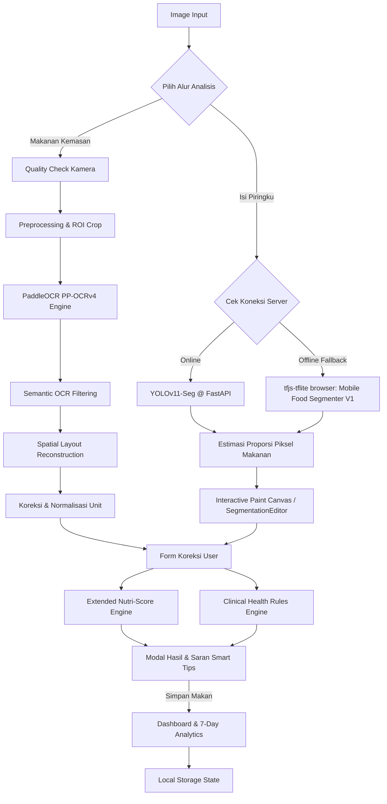

# PANDUAN TEKNIS LENGKAP & ARSITEKTUR NUTRILABEL V3.5 (healthier)
Dokumen ini dirancang sebagai panduan transfer pengetahuan (*knowledge transfer guide*) yang sangat rinci, komprehensif, dan matematis agar model AI eksternal seperti Claude dapat memahami arsitektur, tingkat kerumitan, metode ilmiah, serta detail implementasi per file dari project **NutriLabel v3.5 (healthier)**.

---

## 1. PENGENALAN & TUJUAN UTAMA PROYEK
**NutriLabel v3.5** (dipasarkan dengan nama aplikasi **healthier**) adalah sistem pemantauan gizi harian personal terintegrasi kecerdasan buatan (AI) yang bekerja secara *real-time* di lingkungan web browser dengan dukungan backend AI berbasis Python. Sistem ini dirancang untuk menyelesaikan dua tantangan utama dalam asupan nutrisi:
1. **Ekstraksi Informasi Nilai Gizi Kemasan**: Mengekstrak data angka nutrisi kritis secara otomatis dari citra tabel gizi kemasan yang sering mengalami cacat (kemiringan, pantulan cahaya/glare, noise, watermark latar belakang).
2. **Estimasi Porsi Isi Piringku**: Mengestimasi rasio porsi makanan riil (Makanan Pokok, Lauk-Pauk, Sayur, Buah) berdasarkan segmentasi piksel citra piring makan, dengan dukungan editor interaktif (*canvas painting*) untuk koreksi manual presisi tinggi.

Seluruh data asupan tersebut kemudian dievaluasi menggunakan **Clinical Health Rules Engine** terpersonalisasi (berdasarkan pedoman PERKENI 2024 untuk Diabetes, JNC 8 untuk Hipertensi, dan DASH Diet) serta **Extended Nutri-Score Engine** (modifikasi FSA/Ofcom) guna memberikan saran medis cerdas (*Smart Tips*) dan peringatan bahaya asupan secara visual.

---

## 2. ARSITEKTUR PIPELINE & DUAL-MODE INFERENCE

Sistem ini dirancang dengan toleransi kesalahan tinggi menggunakan pendekatan arsitektur dual-mode:



### A. Alur Pemrosesan Tabel Gizi (OCR)
1. **Video/Image Capture**: Frame kamera dievaluasi secara langsung (*real-time quality loop*) di frontend untuk mendeteksi blur, pencahayaan minim, kontras rendah, atau pantulan cahaya sebelum gambar diambil.
2. **Crop Area**: Pengguna mengisolasi tabel gizi menggunakan modul CropperJS di frontend.
3. **Backend API Post**: Gambar ROI (Region of Interest) dikirim ke API server lokal FastAPI (`http://127.0.0.1:8000/api/ocr`).
4. **Computer Vision Preprocessing (Backend)**:
   * **Deskewing**: Deteksi sudut rotasi tabel gizi dengan *Hough Lines Transform* dan rotasi balik (affine warping).
   * **Deglaring**: Masking saturasi intensitas tinggi untuk melokalisasi glare lalu di-inpainting dengan algoritma OpenCV.
   * **Watermark Removal**: HSV Thresholding untuk menghilangkan teks/kisi di belakang teks utama gizi.
   * **CLAHE**: Menyeimbangkan kontras lokal untuk memperjelas cetakan teks gizi yang pudar.
5. **OCR Inference (PaddleOCR PP-OCRv4 + PP-Structure)**:
   * Melakukan OCR pada gambar ROI untuk mendapatkan koordinat boks deteksi (`bbox`) dan transkrip teks mentah.
   * Mendeteksi struktur tabel secara paralel dengan model SLANet (PP-Structure) jika diaktifkan.
6. **Semantic Filtering & Row/Column Reconstruction**:
   * Membuang teks promosi, komposisi panjang, lisensi BPOM, tanggal, dll.
   * Mengelompokkan teks ke dalam baris menggunakan toleransi ketinggian baris median (*Y-Band Grouping*).
   * Mendeteksi batasan kolom horizontal untuk membedakan pilar "Per Sajian", "%AKG", dan "Per 100g" secara spasial.
   * Melakukan pembersihan teks tingkat karakter (regex normalizer) untuk memperbaiki salah baca umum seperti "g" terbaca "9", "o/O" terbaca "0", "I/l" terbaca "1".
   * Menerapkan fallback matematis (misalnya kalkulasi gram lemak dari kkal energi lemak).
7. **Clinical Validation (Python Backend)**: Menyaring nilai yang tidak masuk akal secara fisik (misal kalori > 900 kkal per porsi, karbohidrat > 150g per porsi) sebelum dikirim kembali ke frontend.

### B. Alur Analisis Piring Makan (Isi Piringku)
1. **FastAPI Request**: Citra piring dikirim ke `/api/isi-piringku`.
2. **Online Mode (YOLOv11-Seg)**:
   * Model segmentasi instansiasi YOLOv11 (`best.pt`) dijalankan di backend.
   * Model mendeteksi 4 kelas gizi makanan: Makanan Pokok, Lauk-Pauk, Sayuran, Buah-buahan.
   * Semua kelas non-makanan (piring, mangkok, gelas, sendok, garpu, tangan) difilter keluar dari perhitungan statistik piksel piring.
3. **Offline Fallback Mode (TensorFlow.js TFLite WASM)**:
   * Jika backend API terputus, frontend secara otomatis beralih ke engine TFJS-TFLite lokal di browser.
   * Model `best_float16.tflite` (berbasis arsitektur DeepLab-V3 + MobileNet-V2) dimuat langsung ke WebAssembly browser untuk inferensi offline di CPU/GPU perangkat pengguna.
4. **Interactive Editor Canvas Overlay**:
   * Mask segmentasi (baik dari YOLO maupun TFLite) digambar di atas kanvas HTML5 transparan 60%.
   * Jika terdapat kesalahan deteksi AI, pengguna dapat menggunakan *Brush/Kuas Koreksi* berwarna (Kuning = Pokok, Merah = Lauk, Hijau = Sayur, Ungu = Buah) atau *Penghapus/Eraser* secara interaktif.
   * Canvas mendukung multi-touch/mouse untuk Zoom-In, Zoom-Out, dan Panning, lengkap dengan viewport minimap di sudut layar dan *Undo/Redo Stack* berbasis gambar state.
5. **Estimasi Proporsi & Validasi**:
   * Persentase dihitung murni dari: $\text{Kategori Piksel} / \text{Total Piksel Makanan} \times 100\%$.
   * Hasil divalidasi berdasarkan profil klinis pengguna dan disimpan dalam riwayat dashboard.

---

## 3. METODE ILMIAH & LOGIKA MATEMATIS MATRIKS EVALUASI

### A. Extended Nutri-Score Engine (Ofcom/FSA dengan Ekstensi)
Nutri-Score dihitung dengan menetapkan skor poin penalti (Negative/N-Points) dan poin manfaat (Positive/P-Points) per 100g atau 100ml makanan terlarut.

#### 1. Negative Points (N-Points, Skor 0-10)
N-Points dihitung dari akumulasi 4 komponen:
* **Poin Energi ($E$)**: Dihitung dari $\text{kJ per 100g}$ dengan ambang batas:
  $[335, 670, 1005, 1340, 1675, 2010, 2345, 2680, 3015, 3350]\text{ kJ}$
* **Poin Gula ($S$)**: Dihitung dari $\text{g gula per 100g}$ dengan ambang batas:
  $[4.5, 9.0, 13.5, 18.0, 22.5, 27.0, 31.0, 36.0, 40.0, 45.0]\text{ g}$
* **Poin Lemak Jenuh ($F$)**: Dihitung dari $\text{g lemak jenuh per 100g}$ dengan ambang batas:
  $[1, 2, 3, 4, 5, 6, 7, 8, 9, 10]\text{ g}$
* **Poin Natrium ($Na$)**: Dihitung dari $\text{mg sodium per 100g}$ dengan ambang batas:
  $[90, 180, 270, 360, 450, 540, 630, 720, 810, 900]\text{ mg}$

$$\text{Total N} = Pts(E) + Pts(S) + Pts(F) + Pts(Na) \quad (\text{Skor Maksimal } 40)$$

*(Catatan: Untuk minuman cair/beverage, ambang batas Energi dan Gula disesuaikan dengan nilai yang lebih ketat).*

#### 2. Positive Points (P-Points, Skor 0-5)
P-Points dihitung dari akumulasi 3 komponen:
* **Poin Buah, Sayur, Kacang-kacangan ($FVN$)**: Dihitung berdasarkan persentase volume bahan mentah segar:
  $>0\% \to 1$, $>20\% \to 2$, $>40\% \to 3$, $>60\% \to 4$, $>80\% \to 5$ poin.
* **Poin Serat ($Fib$)**: Dihitung dari $\text{g serat per 100g}$ dengan ambang batas:
  $[0.9, 1.9, 2.8, 3.7, 4.7]\text{ g}$
* **Poin Protein ($Pro$)**: Dihitung dari $\text{g protein per 100g}$ dengan ambang batas:
  $[1.6, 3.2, 4.8, 6.4, 8.0]\text{ g}$

#### 3. Aturan Khusus Protein (Protein Modification Rule)
Untuk mencegah produsen memanipulasi nilai Nutri-Score dengan menambahkan protein terisolasi ke produk yang sangat tinggi gula atau garam, diterapkan logika berikut:
$$\text{Jika } \text{Total N} \ge 11 \text{ dan } FVN < 80\% \text{, maka } Pts(Pro) \text{ dipaksa menjadi } 0 \text{ dalam total P-Points.}$$

#### 4. Ekstrak Fitur Khusus NutriLabel v3.5 (Extensions)
Sistem ini memodifikasi algoritma standar dengan menyuntikkan 4 ekstensi kritis:
1. **Bonus Mikronutrien ($P_{micro}$, Maksimal 3 Poin)**:
   * Vitamin C: $\ge 80\text{ mg} \to 1\text{ pt}, \ge 160\text{ mg} \to 2\text{ pts}$
   * Kalsium: $\ge 400\text{ mg} \to 1\text{ pt}$
   * Zat Besi: $\ge 7\text{ mg} \to 1\text{ pt}$
   * Folat: $\ge 200\text{ mcg} \to 1\text{ pt}$
   * Vitamin B-Kompleks (B1 + B6 + B12 semuanya ada) $\to 1\text{ pt}$
2. **Serving Fraction Scaling**: Mengalikan seluruh zat gizi yang dikonsumsi dengan faktor fraksi porsi ($1$, $0.75$, $0.5$, $0.33$, $0.25$) sehingga grafik dashboard melacak konsumsi aktual pengguna, bukan hanya per-kemasan.
3. **Powder Reconstitution Mode**: Jika produk berupa minuman serbuk kemasan kering, berat takaran saji dilarutkan ke dalam volume air ($X$ ml) sehingga densitas gizi dihitung ulang per 100ml cairan terlarut sebelum evaluasi skor dilakukan.
4. **Smart Tips**: Secara dinamis merumuskan tips berdasarkan kombinasi grade akhir dan keberadaan mikronutrien (misalnya: "Produk grade C, namun kaya vitamin C & kalsium, aman dikonsumsi porsi sedang").

#### 5. Perhitungan Skor Akhir & Grade
$$\text{Nutri-Score} = \text{Total N} - (\text{Total P} + P_{micro})$$

* **Makanan Padat**: $\le -1 \to \mathbf{A}$, $\le 2 \to \mathbf{B}$, $\le 10 \to \mathbf{C}$, $\le 18 \to \mathbf{D}$, lainnya $\to \mathbf{E}$.
* **Minuman Cair**: $\le -1 \to \mathbf{A}$, $\le 2 \to \mathbf{B}$, $\le 6 \to \mathbf{C}$, $\le 9 \to \mathbf{D}$, lainnya $\to \mathbf{E}$.

---

### B. Clinical Health Rules Engine
Menghitung metabolisme energi dasar dan menerapkan aturan override berdasarkan penyakit bawaan.

#### 1. Penghitungan BMR (Mifflin-St Jeor) & TDEE
* **BMR Laki-laki**: $10 \times \text{Berat (kg)} + 6.25 \times \text{Tinggi (cm)} - 5 \times \text{Umur (tahun)} + 5$
* **BMR Perempuan**: $10 \times \text{Berat (kg)} + 6.25 \times \text{Tinggi (cm)} - 5 \times \text{Umur (tahun)} - 161$
* **TDEE (Total Daily Energy Expenditure)**: $\text{BMR} \times 1.2$ (Disederhanakan untuk level aktivitas menetap/sedentary).

#### 2. Tabel Modifikasi Batas Gizi Klinis (Onboarding Profile)

| Parameter Batas Harian | Pengguna Umum | Diabetes Melitus (PERKENI 2024) | Hipertensi (JNC 8 + DASH) | Nefropati Diabetik (Gangguan Ginjal) | Dislipidemia |
| :--- | :--- | :--- | :--- | :--- | :--- |
| **Max Kalori Cemilan** | 20% TDEE | 20% TDEE | 20% TDEE | 20% TDEE | 20% TDEE |
| **Batas Gula** | 10% TDEE (~50g) | **5% TDEE (~25g)** | 10% TDEE | 5% TDEE | 10% TDEE |
| **Batas Natrium (Sodium)** | 2300 mg | 2300 mg | **1500 mg** | 2300 mg | 2300 mg |
| **Batas Lemak Jenuh** | 10% TDEE | 10% TDEE | 10% TDEE | 10% TDEE | **7% TDEE** |
| **Kolesterol Harian** | Bebas | Bebas | Bebas | Bebas | **Max 200 mg** |
| **Kuota Protein Harian** | Bebas | Bebas | Bebas | **0.8g × kg Berat Badan** | Bebas |
| **Porsi Makanan Pokok** | Ideal: 33.33% | **Batas Atas: 35%** | Ideal: 33.33% | Ideal: 33.33% | Ideal: 33.33% |
| **Porsi Sayuran** | Ideal: 33.33% | Ideal: 33.33% | **Batas Bawah: 30%** | Ideal: 33.33% | Ideal: 33.33% |

#### 3. Logika Pemicu Warning Klinis
* **Penderita Nefropati**: Jika kandungan protein per porsi makan melebihi 30% dari total kuota ginjal harian, picu pesan peringatan klinis untuk memprioritaskan protein hewani berkualitas tinggi (65% HBV) demi meringankan beban ekskresi ginjal.
* **Penderita Hipertensi**: Jika natrium per 100g produk $> 600\text{ mg}$ (makanan tinggi garam) atau asupan per porsi $> 40\%$ kuota natrium harian (600 mg), picu status `WARNING` / `DANGER` secara klinis meskipun grade Nutri-Score-nya bagus (misalnya sereal gandum instan tinggi protein tetapi tinggi natrium).

---

### C. Metrik Riset & Justifikasi Penolakan CER / WER
Script pengujian batch (`evaluasi_batch.py`) dirancang untuk mengevaluasi akurasi sistem pengekstraksi gizi dunia nyata.

#### 1. Metrik Utama (Nutrient-Centric)
* **Field Accuracy**: Akurasi pengekstraksian nilai angka per field nutrisi dibanding ground truth gizi kemasan dengan toleransi $\le 5\%$ atau $\pm 1$ unit. Target utama $\ge 85\%$.
* **Nutrition Precision**: Rasio field gizi terprediksi yang tergolong valid/benar terhadap total field gizi yang terdeteksi oleh OCR.
* **Nutrition Recall**: Rasio field gizi terprediksi secara benar terhadap seluruh field gizi yang tertera di ground truth.
* **Detection Rate**: Persentase field gizi ground truth yang berhasil diekstrak (terbaca) secara spasial oleh OCR.

#### 2. Justifikasi Penolakan CER/WER (Character/Word Error Rate) Sebagai Metrik Utama
Dalam riset ekstraksi label nutrisi kemasan riil, CER dan WER tidak valid digunakan sebagai indikator utama performa sistem dengan alasan klinis dan teknis berikut:
1. **Penyaringan Semantik (Semantic Noise Filter)**: Kemasan riil memuat banyak blok teks iklan ("Makin Nikmat!", "Promo Spesial"), instruksi masak ("Rebus dalam 400ml air"), lisensi pabrik, dan barcode. OCR global akan membaca teks non-gizi ini, namun sistem secara sengaja memfilternya keluar. Jika transkrip OCR dibandingkan secara mentah dengan transkrip dokumen lengkap (ground truth transkrip penuh), CER/WER akan bernilai sangat buruk (tinggi), padahal seluruh field gizi penting (Gula, Lemak Jenuh, Kalori) terekstrak dengan akurasi 100%.
2. **Kekritisan Klinis Nilai Angka**: Secara medis, kesalahan kecil transkripsi huruf pada slogan promosi (misal "Lezat" terbaca "Le2at") tidak membahayakan kesehatan pengguna. Sebaliknya, kesalahan baca satu digit angka gizi akibat pantulan cahaya (misal natrium "80 mg" terbaca "800 mg") adalah hal fatal yang dapat membahayakan penderita hipertensi. Evaluasi berbasis **Field Accuracy** menilai kecocokan nilai klinis secara spesifik, sehingga jauh lebih representatif untuk mengukur performa sistem kesehatan dibanding CER/WER transkrip penuh.

---

## 4. DOKUMENTASI DETAIL PER FILE KODE

Berikut adalah ringkasan teknis dan penjelasan fungsi untuk seluruh file dalam proyek ini:

### 📄 [index.html](file:///d:/Labolatorium%20Anti%20Gravity/NutrilLabel%20v3.5/index.html)
* **Peran**: Halaman antarmuka utama (UI) aplikasi web *healthier*.
* **Teknologi**: HTML5 Semantik, Google Fonts (Outfit), CropperJS CDN, ChartJS CDN, FontAwesome Icons.
* **Fitur Utama**:
  * Form onboarding multi-step untuk data fisik (umur, berat, tinggi, jenis kelamin) dan toggle status medis (diabetes, ginjal, lipid, hipertensi).
  * Dashboard pemantauan gizi harian interaktif dengan visual progress bar SVG melingkar untuk gula, serta bar charts Chart.js untuk riwayat 7 hari.
  * Preview kamera video langsung (*live camera stream*) lengkap dengan *overlay laser scanner* dan visualisasi deteksi kualitas frame.
  * Antarmuka CropperJS untuk memotong ROI tabel gizi sebelum diunggah ke backend.
  * Panel hasil evaluasi gizi (*Nutri-Score*) yang menampilkan letter grade (A-E) besar, visualisasi boks deteksi OCR berwarna-warni di atas canvas citra kemasan yang di-crop, dan daftar teks transkrip detail.
  * Antarmuka "Isi Piringku" yang menampilkan overlay canvas piring makan, tool brush/eraser untuk manipulasi piksel warna kategori makanan, tombol zoom & pan, serta minimap pelacak viewport.
  * Modal detail rincian perhitungan poin gizi negatif, positif, mikronutrien, status klinis, dan tips cerdas.

### 📄 [style.css](file:///d:/Labolatorium%20Anti%20Gravity/NutrilLabel%20v3.5/style.css)
* **Peran**: Desain visual premium untuk keseluruhan aplikasi.
* **Teknologi**: Vanilla CSS dengan Custom Property (Variabel CSS), Flexbox, CSS Grid.
* **Detail Estetika**:
  * Konsep *Glassmorphic design* menggunakan filter `backdrop-filter: blur(12px)` dan perbatasan halus bertransparansi.
  * Skema warna HSL yang terkurasi (hijau bernuansa pastel untuk asupan seimbang, amber untuk warning, merah gelap untuk bahaya klinis).
  * Desain tombol dengan efek transisi micro-animation halus saat di-hover/active.
  * Layout responsif penuh yang menyesuaikan tampilan dengan mulus antara smartphone layar vertikal dan desktop lebar.

### 📄 [app.js](file:///d:/Labolatorium%20Anti%20Gravity/NutrilLabel%20v3.5/app.js)
* **Peran**: Logika pengendali (*orchestrator*) frontend, manajemen state lokal, kamera, UI event listeners, dan rendering grafik.
* **Metode Kunci**:
  * `loadState() / saveState()`: Menyimpan dan memuat profil pengguna serta riwayat makan dari `localStorage` browser.
  * `switchView(viewId)`: Mengatur perpindahan tab view dashboard, kamera, editor piring, dan hasil scan secara spa (*single page*).
  * `startCamera() / stopCamera()`: Menginisialisasi aliran kamera perangkat.
  * `estimateCanvasQuality(canvas)`: Mengolah pixel frame kamera beresolusi rendah setiap 900ms untuk mengevaluasi tingkat kecerahan, kontras (standar deviasi intensitas luminance), dan pantulan cahaya (*glare*). Menghasilkan tips real-time untuk memandu pengguna memosisikan kamera secara optimal sebelum memotret.
  * `renderOcrBboxOverlay(payload)`: Menggambar ulang boks deteksi OCR di atas canvas kemasan. Mewarnai boks secara real-time berdasarkan kategori (Hijau untuk kata kunci nutrisi, Kuning untuk nilai numerik gizi, Merah Muda untuk teks non-gizi/diabaikan).
  * `btnCalculate.addEventListener('click')`: Mengambil seluruh nilai dari formulir koreksi, menghitung porsi fraksi, melarutkan mode serbuk, memanggil library `NutriScore` dan `ClinicalHealthRules`, memperbarui UI modal hasil, dan menyimpan entri ke riwayat asupan harian.

### 📄 [nutrilabel_v3_ppocr.py](file:///d:/Labolatorium%20Anti%20Gravity/NutrilLabel%20v3.5/nutrilabel_v3_ppocr.py)
* **Peran**: Jantung pemrosesan backend AI. Menggabungkan pipeline OCR tabel kemasan (PaddleOCRv4), segmentasi piring (YOLOv11-Seg), dan framework API FastAPI.
* **Tingkat Kerumitan & Algoritma Utama**:
  * **`PPOCREngine` (Singleton Class)**: Menjamin model PaddleOCR PP-OCRv4 dan model PP-Structure SLANet dimuat hanya sekali ke dalam RAM saat server dinyalakan demi menghemat resource komputasi GPU/CPU.
  * **`Preprocessor` Class**:
    * **`deglare()`**: Mendeteksi area pantulan cahaya dengan thresholding nilai saturasi dan intensitas, membuat mask area glare, lalu menerapkan metode `cv2.inpaint()` berbasis *Navier-Stokes* untuk memulihkan piksel teks yang tertutup pantulan cahaya.
    * **`deskew()`**: Menerapkan deteksi tepi Canny dan *Hough Lines Transform* untuk mencari sudut orientasi garis tabel yang miring. Mengoreksi rotasi global gambar menggunakan transformasi matriks rotasi affine warp.
    * **`remove_watermark()`**: Melakukan konversi gambar ke HSV, mendeteksi saturasi warna background yang mengganggu cetakan teks gizi utama, lalu mengganti area ber-watermark dengan inpainting.
  * **Reconstruction Engine (`rekonstruksi_tabel_kolom()`)**:
    * Membagi boks teks OCR ke dalam kelompok baris logis dengan *Y-Band Grouping* menggunakan toleransi tinggi median boks.
    * Memisahkan baris dengan multi-label (misal jika protein dan lemak tertranskrip dalam baris vertikal yang rapat).
    * Menggunakan metode heuristik spasial untuk mendeteksi sumbu X kolom. Boks nilai gizi disesuaikan secara dinamis dengan label gizi di kolom sebelah kirinya, menghindari salah pasang angka akibat spasi horizontal yang lebar.
    * Pengecekan regex pintar untuk memperbaiki kesalahan parsing OCR (seperti huruf "O" dibaca angka "0", "9" dibaca unit "g", dsb).
  * **`ImageQualityChecker` Class**: Mengevaluasi tingkat kekaburan gambar (menggunakan variansi kernel Laplacian), kontras luminance global, serta densitas boks teks untuk menentukan kelayakan gambar kemasan sebelum diproses.
  * **`YOLOIsiPiringku` Class**:
    * Singleton pembungkus model segmentasi YOLOv11 (`best.pt`).
    * Menyediakan endpoint `/api/isi-piringku` yang menerima unggahan foto piring, melakukan deteksi objek piring dan komponen makanan, mengekstrak poligon koordinat mask segmentasi, menghitung luas proporsi piksel, serta mengembalikan data berformat JSON beserta gambar hasil visualisasi yang sudah diberi warna overlay semi-transparan.
  * **FastAPI Server Setup**: Membuka port local `http://127.0.0.1:8000` dengan middleware CORS terbuka agar dapat diakses oleh frontend HTML/JS.

### 📄 [seefood-segmenter.js](file:///d:/Labolatorium%20Anti%20Gravity/NutrilLabel%20v3.5/seefood-segmenter.js)
* **Peran**: Subsistem segmentasi makanan di frontend browser (Dual-Mode Engine) dan antarmuka editor koreksi segmentasi manual.
* **Metode Kunci**:
  * **`SeeFoodSegmenter.analyze()`**:
    * **Mekanisme Fallback Otomatis**: Pertama kali mencoba mengirim citra piring ke backend lokal uvicorn YOLOv11 (`/api/isi-piringku`). Jika server offline atau mengalami timeout, sistem secara otomatis meredireksi inferensi ke model lokal browser.
    * **Inference TFLite Lokal**: Memuat library `@tensorflow/tfjs-tflite` dan menjalankan model `best_float16.tflite` menggunakan akselerasi WebAssembly (WASM).
    * **Pixel Mapping**: Memetakan indeks dari 27 kelas model makanan Google Mobile Food Segmenter V1 ke dalam 4 kelompok "Isi Piringku" (misalnya mie/nasi dipetakan ke Makanan Pokok, daging/telur ke Lauk Pauk, dsb).
  * **`SegmentationEditor` Class (Interactive Canvas Editor)**:
    * Mengelola overlay kanvas gambar piring makanan.
    * Menangani event mouse/pointer untuk mewarnai manual piksel makanan atau menghapusnya jika hasil segmentasi AI melenceng.
    * Mendukung fitur zoom in/out dan pan canvas untuk mengoreksi detail kecil tepi makanan.
    * Mengelola viewport minimap dan `undoStack` (menyimpan array piksel canvas sebelumnya) sehingga pengguna dapat menekan tombol Undo jika salah menggores kuas.

### 📄 [clinical-rules.js](file:///d:/Labolatorium%20Anti%20Gravity/NutrilLabel%20v3.5/clinical-rules.js)
* **Peran**: Mesin evaluasi status asupan gizi harian berdasarkan standar klinis medis nasional dan internasional.
* **Aturan Klinis PERKENI 2024 (Diabetes)**:
  * Memotong jatah gula harian menjadi hanya 5% dari TDEE (setengah dari batas normal 10% TDEE).
  * Memberikan saran asupan karbohidrat kompleks (berindeks glikemik rendah).
  * Mengatur batas atas proporsi karbohidrat piring makan sehat maksimal 35%.
* **Aturan JNC 8 & DASH Diet (Hipertensi)**:
  * Memangkas batas natrium harian dari 2300mg menjadi maksimal 1500mg.
  * Memicu warning klinis jika makanan mengandung natrium $>600\text{ mg}$ per 100g.
  * Memberikan edukasi target tekanan darah klinis (misal target $<140/90\text{ mmHg}$ untuk diabetisi/pasien ginjal, atau $<150/90\text{ mmHg}$ untuk pasien geriatri usia $\ge 60$ tahun).
* **Aturan Nefropati Diabetik**:
  * Membatasi kuota protein harian menjadi $0.8\text{ g}$ per kg berat badan.
  * Memberikan saran klinis untuk membagi porsi protein hewani bernilai biologis tinggi sebesar 65% untuk mengurangi penumpukan uretra berlebih pada filtrasi glomerulus ginjal.
* **Aturan Dislipidemia**: Membatasi konsumsi lemak jenuh harian maksimal 7% TDEE dan kolesterol maksimal 200mg.

### 📄 [nutri-score.js](file:///d:/Labolatorium%20Anti%20Gravity/NutrilLabel%20v3.5/nutri-score.js)
* **Peran**: Implementasi algoritma standarisasi kualitas gizi makanan kemasan Ofcom/FSA Eropa.
* **Fungsi Kunci**:
  * `calculateNutriScore(nutrition100, isLiquid, micronutrients, context)`:
    * Menerapkan pembobotan titik gizi negatif (energi, gula, lemak jenuh, sodium) dan titik gizi positif (serat, protein, persen buah-sayuran).
    * Mengintegrasikan bonus mikronutrien (Vitamin C, zat besi, kalsium, folat, B-kompleks) untuk memengaruhi hasil skor akhir secara positif.
    * Memutuskan pemotongan poin protein secara kondisional jika total nilai gizi negatif bernilai buruk ($\ge 11$).
    * Mengembalikan klasifikasi grade akhir (A, B, C, D, E), kode warna representatif, kompilasi alarm bahaya gizi per sajian, serta saran smart tips konsumsi produk.

### 📄 [isi-piringku.js](file:///d:/Labolatorium%20Anti%20Gravity/NutrilLabel%20v3.5/isi-piringku.js)
* **Peran**: Logika evaluasi komposisi porsi piring makan.
* **Detail Implementasi**:
  * Menampung daftar kamus kelompok bahan makanan (`LABEL_MAP`).
  * Menyimpan ambang batas proporsi ideal Isi Piringku untuk kondisi normal (Karbo: 33.3%, Sayur: 33.3%, Lauk-Pauk: 16.6%, Buah: 16.6%).
  * Memodifikasi batas toleransi porsi secara dinamis sesuai profil klinis dari `clinical-rules.js` (misalnya batas karbohidrat menjadi lebih sensitif/sempit bagi penderita diabetes).
  * Membandingkan rasio pixel piring makan pengguna dengan ambang batas klinis dan merumuskan saran perbaikan porsi (misal: "Porsi sayuran kurang dari target minimal 30% bagi penderita hipertensi, tambahkan sayur kaya kalium").

### 📄 [evaluasi_batch.py](file:///d:/Labolatorium%20Anti%20Gravity/NutrilLabel%20v3.5/evaluasi_batch.py)
* **Peran**: Skrip evaluasi performa akurasi sistem OCR kemasan secara massal.
* **Metode Kunci**:
  * `load_ground_truth(foto_path)`: Membaca file gambar pengujian dan mencari file pelengkap berakhiran `_gt.json` (ground truth nutrisi kemasan) dan `_gt.txt` (ground truth teks lengkap).
  * `hitung_nutrition_metrics(gt_json, hasil)`: Membandingkan data nutrisi hasil ekstrak dengan data ground truth riil kemasan. Menghitung precision gizi, recall gizi, rate deteksi spasial, dan mengecek akurasi gram takaran saji (dengan batas toleransi selisih $\pm 5\%$).
  * `evaluasi_batch(folder)`: Melacak seluruh file pengujian dalam folder dataset, menjalankan backend pipeline OCR PaddleOCR untuk mengekstrak informasi gizi, menghitung metrik, menampilkan tabel ringkasan performa di terminal, dan menyimpan statistik detail pengujian ke dalam file `evaluasi_hasil.json`.

---

## 5. REKAPITULASI STATUS PERKEMBANGAN & KERUMITAN FITUR

Berikut adalah metrik status fungsional dan tingkat kompleksitas dari masing-masing pilar project:

| Fitur / Subsistem | File Pendukung | Status Fungsional | Kompleksitas Teknis | Detail Implementasi & Konsep |
| :--- | :--- | :--- | :--- | :--- |
| **Pipeline Preprocessing OCR** | `nutrilabel_v3_ppocr.py` | 100% Selesai & Stabil | **Sangat Tinggi** | Algoritma deskewing (Hough Transform), deglaring (inpainting Navier-Stokes OpenCV), clahe, dan filtering watermark berbasis HSV. |
| **OCR Table Reconstruction** | `nutrilabel_v3_ppocr.py` | 100% Selesai & Stabil | **Tinggi** | Pengelompokan spasial Y-Band, klasifikasi kolom berbasis sumbu koordinat horizontal boks header, regex pembersih teks, dan kalkulasi fallback lemak. |
| **YOLOv11 FastAPI Backend** | `nutrilabel_v3_ppocr.py`, `best.pt` | 100% Selesai & Siap | **Tinggi** | API FastAPI, setup singleton untuk model YOLOv11-Seg, konversi koordinat poligon mask ke array piksel biner, dan penyaringan item non-makanan. |
| **Offline Segmenter Fallback** | `seefood-segmenter.js`, `best_float16.tflite` | 100% Selesai & Siap | **Tinggi** | Library TFJS-TFLite di browser, WASM runtime, pemetaan 27 kelas model Google ke 4 kelompok gizi klinis Isi Piringku. |
| **Segmentation Editor Canvas** | `seefood-segmenter.js`, `index.html` | 100% Selesai & Siap | **Tinggi** | Canvas HTML5 interaktif, brush warna per kategori makanan, eraser, zoom & pan matrix transformation, minimap viewport, undo/redo stack. |
| **Extended Nutri-Score Engine**| `nutri-score.js` | 100% Selesai & Terintegrasi | **Sedang** | Algoritma FSA/Ofcom diperluas dengan bonus poin mikronutrien, serving scaling, powder reconstitution, dan smart tips generator. |
| **Clinical Health Rules Engine**| `clinical-rules.js`, `isi-piringku.js`| 100% Selesai & Terintegrasi | **Sedang** | Logika metabolisme energi BMR/TDEE, override batasan asupan harian berdasarkan diabetes PERKENI 2024 dan hipertensi JNC 8 + DASH. |
| **Batch Evaluator & Riset** | `evaluasi_batch.py` | 100% Selesai & Siap Pakai | **Sedang** | Pengujian batch otomatis berbasis file `_gt.json` untuk menghitung akurasi field-level, precision, recall, dan serving size accuracy. |
| **Camera Quality Loop UI** | `app.js`, `index.html` | 100% Selesai & Aktif | **Sedang** | Evaluasi real-time frame video kamera (variansi Laplacian untuk blur, standar deviasi pixel untuk kontras) sebelum foto diambil. |
| **Frontend UI/UX Premium** | `index.html`, `style.css`, `app.js` | 100% Selesai & Responsif | **Sedang** | Desain glassmorphism modern, visualisasi boks deteksi OCR berwarna-warni di frontend canvas, ChartJS 7-day asupan, multi-step onboard. |

---

## 6. CARA MENJALANKAN SYSTEM SECARA LOKAL
1. **Instalasi Python Dependencies**:
   ```bash
   pip install -r requirements_v3_ppocr.txt
   ```
   *(Pastikan menginstal PyTorch dan PaddlePaddle GPU/CPU sesuai dengan hardware perangkat)*
2. **Menjalankan Backend Server (FastAPI)**:
   ```bash
   python nutrilabel_v3_ppocr.py
   ```
   Server akan berjalan secara default di `http://127.0.0.1:8000`. Endpoint yang tersedia:
   * `GET /api/health` - Cek status kesiapan server, ketersediaan GPU, dan model YOLO.
   * `POST /api/ocr` - Menerima upload file gambar ROI kemasan, mengembalikan transkrip gizi terekstrak beserta koordinat boks.
   * `POST /api/isi-piringku` - Menerima upload file gambar piring makan, mengembalikan hasil segmentasi YOLOv11 dan proporsi gizi makanan.
3. **Menjalankan Batch Evaluator (Riset)**:
   ```bash
   python evaluasi_batch.py --folder Dataset --recursive --gt-only
   ```
4. **Menjalankan Frontend**:
   Buka file `index.html` secara langsung di browser atau jalankan web server ringan (seperti VS Code Live Server atau `python -m http.server 8080`). Pastikan server FastAPI backend sudah menyala agar pemindaian OCR dan segmentasi online YOLOv11 bekerja dengan lancar. Jika backend mati, frontend akan otomatis beroperasi dengan mode TFLite lokal.
