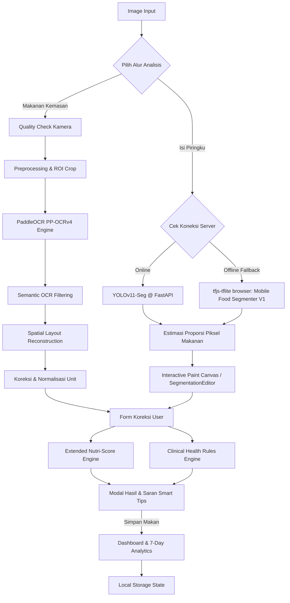

# NutriLabel v3 - Real-World Nutrition Extraction & Plate Proportion Estimation System

## Ringkasan Eksekutif

NutriLabel v3 (atau dipasarkan dengan nama aplikasi **healthier**) dirancang sebagai sistem pemantauan gizi harian personal yang komprehensif berbasis kecerdasan buatan (AI). Berbeda dari sistem transkripsi dokumen tradisional, kegunaan klinis sistem ini diukur dari dua pilar utama:
1. **Subsistem OCR Label Nutrisi (Kemasan)**: Mengekstrak field gizi kritis seperti energi, lemak, lemak jenuh, protein, karbohidrat, gula, natrium, serat, serta takaran saji secara akurat dari foto kemasan makanan nyata.
2. **Subsistem Estimasi Porsi Makan (Isi Piringku)**: Mendeteksi proporsi kelompok makanan (karbohidrat, lauk-pauk, sayur, buah) di piring dari foto makanan riil menggunakan segmentasi gambar dual-mode.

Seluruh data yang diperoleh diintegrasikan ke dalam **Clinical Health Rules Engine** (berdasarkan standar klinis nasional PERKENI 2024 dan internasional JNC 8 + DASH Diet) dan **Extended Nutri-Score Engine** (FSA/Ofcom dengan modifikasi mikronutrien dan fraksi porsi) untuk memberikan visualisasi asupan harian, status bahaya klinis, serta saran konsumsi yang dipersonalisasi.

---

## Arsitektur Sistem & Pipeline Produksi

Berikut adalah alur data dari input gambar hingga visualisasi dashboard dan evaluasi klinis:

---

## Subsistem 1: OCR Tabel Nutrisi Kemasan

Untuk menangani variasi citra kemasan di lapangan (noise, glare, rotasi, watermark), subsistem OCR mengimplementasikan pipeline berikut di Python (`nutrilabel_v3_ppocr.py`):

### 1. Preprocessing Tingkat Produksi
* **Deskew**: Koreksi rotasi global menggunakan *Hough Transform* untuk menyejajarkan garis horizontal tabel.
* **Deglare**: Pendeteksian area pantulan cahaya (glare) dengan threshold saturasi tinggi, dilanjutkan dengan inpainting menggunakan OpenCV.
* **Watermark Removal**: Penghapusan logo/kisi latar belakang yang mengganggu melalui masking HSV dan inpainting.
* **CLAHE (Contrast Limited Adaptive Histogram Equalization)**: Peningkatan kontras lokal pada kanal luminance untuk memperjelas teks kecil yang redup.

### 2. Algoritma ROI Detection (Nutrition Table Isolation)
Untuk memfokuskan pembacaan hanya pada area tabel gizi, sistem mengisolasi ROI dengan urutan strategi fallback:
* **Landscape Side Selection**: Jika rasio lebar terhadap tinggi kemasan > 1.25, sistem memilih setengah sisi gambar yang memiliki kepadatan teks dan kecerahan lebih tinggi.
* **Horizontal Line Clustering**: Mencari garis horizontal paralel menggunakan operator morfologi opening. Jika ditemukan kluster garis yang dominan, bounding box luar diambil sebagai tabel gizi.
* **White Panel Fallback**: Jika garis tabel tidak jelas, sistem mendeteksi panel persegi berwarna cerah dengan saturasi rendah yang dikelilingi tepi teks padat.
* **Full Image Fallback**: Jika semua gagal, sistem menggunakan gambar asli namun membubuhkan warning metadata di log.

### 3. Semantic OCR Filtering
PaddleOCR PP-OCRv4 mendeteksi boks teks. Teks yang tertranskrip disaring berdasarkan relevansi semantik nutrisi menggunakan daftar kata kunci (`KAMUS_NUTRISI` dan `NUTRITION_ANCHOR_TERMS`):
* **KEEP**: Teks yang memuat nama nutrisi (mis. "Protein", "Saturated Fat"), nilai numerik bersatuan g/mg/kkal/%, atau angka yang berada sangat dekat dengan label nutrisi.
* **REMOVE**: Teks promosi, komposisi panjang (*ingredients*), tanggal kedaluwarsa, kode produksi, dan instruksi memasak (mis. "dididihkan", "www.indofood.com").

### 4. Reconstruction Engine (Spatial Graph)
* **Y-Band Grouping**: Boks teks OCR diurutkan secara vertikal lalu horizontal. Boks yang berada dalam rentang toleransi median tinggi baris digabungkan menjadi satu baris logis.
* **Column Detection**: Sistem mendeteksi layout kolom dengan memetakan posisi horizontal koordinat X boks header ("Per Sajian / Serving Size" vs "%AKG / %DV" vs "Per 100g"). 
* **Split-Box Parsing & Fallback**:
  * Menggunakan regex pintar untuk menormalkan noise pembacaan OCR (mis. "g" terbaca "9", "0g" terbaca "og", "0mg" terbaca "omg").
  * **Kalkulasi Lemak dari Kalori**: Jika lemak total tidak terbaca tetapi baris *Energi dari Lemak* terbaca, sistem menghitung estimasi gram lemak menggunakan pembulatan step 0.5g terdekat (`kkal_lemak / 9`).
  * **Pencarian Takaran Saji**: Melakukan scanning horizontal dan vertikal multi-baris di sekitar teks anchor "Takaran Saji" untuk menemukan angka bersatuan gram (g) atau mililiter (ml).

---

## Subsistem 2: Estimasi Porsi Makan (Isi Piringku)

Subsistem ini dirancang untuk mendeteksi proporsi 4 jenis makanan di piring sesuai pedoman "Isi Piringku" (Ridhani et al., 2021).

### 1. Dual-Mode Inference
Sistem menjamin keandalan pemakaian di lapangan melalui mekanisme toleransi kegagalan jaringan:
* **Online Mode (YOLOv11-Seg)**:
  * Mengirim gambar ke FastAPI `/api/isi-piringku` yang menjalankan model YOLOv11 Segmentation (`best.pt`).
  * Model ini dilatih khusus untuk mendeteksi dan melakukan segmentasi piksel 4 kelas makanan (Makanan Pokok/Karbohidrat, Lauk-Pauk/Protein, Sayuran, Buah-buahan).
  * Sistem secara otomatis mengabaikan deteksi non-makanan (seperti garpu, sendok, piring, gelas, tangan) agar perhitungan proporsi murni didasarkan pada piksel makanan saja.
* **Offline Fallback Mode (TFJS-TFLite)**:
  * Jika API backend uvicorn lokal mati atau tidak dapat diakses, frontend di browser memuat library `@tensorflow/tfjs-tflite` dan menjalankan model `best_float16.tflite` secara lokal via WASM.
  * Model fallback ini mengekstrak segmentasi berbasis arsitektur *DeepLab-V3 + MobileNet-V2* (Google Mobile Food Segmenter V1).
  * Notifikasi berupa banner toast ("Mode Offline / AI Server Aktif") akan muncul untuk mengedukasi pengguna.

### 2. Interactive Paint Canvas & Editor UI
Karena segmentasi otomatis dari AI tidak selalu 100% akurat di kondisi nyata, sistem menyediakan **Segmentation Editor** interaktif di frontend:
* **Interactive Canvas Painting**: Menggunakan canvas HTML5 overlay bertransparansi 60%. Pengguna dapat memilih brush tool warna (Kuning untuk Karbo, Merah untuk Lauk, Hijau untuk Sayur, Ungu untuk Buah) atau Penghapus (Eraser) untuk mewarnai atau mengoreksi area segmentasi secara langsung dengan sentuhan/kursor.
* **Canvas Transformation (Zoom & Pan)**: Ketika zoom > 1x, editor masuk ke mode panning (geser canvas). Terdapat tombol zoom in, zoom out, dan reset transformasi.
* **Viewport Minimap**: Di bagian sudut canvas, terdapat minimap kecil yang menunjukkan letak kotak merah viewport navigasi terhadap keseluruhan gambar piring saat di-zoom.
* **Undo/Redo Stack**: Menyimpan state canvas di memori lokal sehingga pengguna bisa membatalkan goresan kuas yang salah.

---

## Clinical Health Rules Engine

Mesin klinis (`clinical-rules.js`) mengimplementasikan aturan medis yang terpersonalisasi untuk mendeteksi tingkat risiko konsumsi makanan berdasarkan profil fisik dan riwayat penyakit pengguna:

### 1. Dasar Regulasi Medis
* **Diabetes Melitus Tipe 2**: Mengacu pada pedoman nasional **PERKENI 2024**.
* **Hipertensi**: Mengacu pada standar global **JNC 8** dan **DASH Diet**.

### 2. Personalisasi Batas Harian (Onboarding Overrides)
Saat onboarding, pengguna mengisi jenis kelamin, umur, berat badan, tinggi badan, dan kondisi kesehatan. Sistem menghitung BMR dan TDEE serta menerapkan *override* klinis:

| Parameter Batas Harian | Pengguna Umum | Pasien Diabetes (PERKENI) | Pasien Hipertensi (JNC 8) | Pasien Nefropati Diabetik (Ginjal) | Pasien Dislipidemia |
| :--- | :--- | :--- | :--- | :--- | :--- |
| **Max Calorie Snack** | 20% TDEE | 20% TDEE | 20% TDEE | 20% TDEE | 20% TDEE |
| **Max Sugar** | 10% TDEE (~50g) | **5% TDEE** (~25g) | 10% TDEE | 5% TDEE | 10% TDEE |
| **Max Sodium** | 2300 mg | 2300 mg | **1500 mg** | 2300 mg | 2300 mg |
| **Max Saturated Fat** | 10% TDEE | 10% TDEE | 10% TDEE | 10% TDEE | **7% TDEE** |
| **Max Cholesterol** | Bebas | Bebas | Bebas | Bebas | **200 mg** |
| **Max Protein** | Bebas | Bebas | Bebas | **0.8g × kg Berat Badan** | Bebas |
| **Porsi Makanan Pokok** | Ideal: 33.33% | **Batas Atas: 35%** | Ideal: 33.33% | Ideal: 33.33% | Ideal: 33.33% |
| **Porsi Sayuran** | Ideal: 33.33% | Ideal: 33.33% | **Batas Bawah: 30%** | Ideal: 33.33% | Ideal: 33.33% |

### 3. Logika Evaluasi Makanan & Output Warning
Evaluator membandingkan kandungan nutrisi makanan (diskalakan dengan takaran porsi yang dikonsumsi) terhadap profil pengguna untuk melabeli status makan (`SAFE`, `WARNING`, `DANGER`):
* **Diabetes Warning**: Memberi tanda `WARNING` jika gula > 50% batas harian dan `DANGER` jika > 100% batas harian.
* **Nephropathy Warning**: Memicu warning klinis jika protein per porsi > 30% dari kuota ginjal harian, disertai anjuran untuk memprioritaskan protein hewani bernilai biologis tinggi (65%).
* **Hypertension Warning**: Memicu peringatan jika kadar natrium dalam produk melebihi 600mg per 100g makanan (makanan tinggi garam) atau jika kontribusinya > 40% batas harian.
* **Target Tekanan Darah**: Memberikan ringkasan edukasi klinis JNC 8 (mis. target < 140/90 mmHg untuk penderita diabetes/ginjal, dan < 150/90 mmHg untuk usia lanjut ≥60 tahun).

---

## Extended Nutri-Score Engine

Sistem mengadopsi standar **FSA/Ofcom** untuk menghitung klasifikasi nilai gizi (Grade A ke E) pada makanan padat maupun cair dengan perluasan fitur:

### 1. Perhitungan Dasar
* **N-Points (Negative)**: Energi (kJ), Gula total (g), Lemak jenuh (g), Natrium (mg) masing-masing diberi skor 0 hingga 10.
* **P-Points (Positive)**: Persentase Buah/Sayur/Kacang (FVN%), Serat pangan (g), Protein (g) diberi skor 0 hingga 5.
* **Aturan Khusus Protein**: Jika total N-Points $\ge 11$, poin protein diatur menjadi $0$ kecuali jika persentase FVN $\ge 80\%$. Ini mencegah produk tinggi gula/garam mendapatkan nilai bagus hanya karena tinggi protein tambahan.

### 2. Fitur Tambahan (Extension Features)
* **Bonus Mikronutrien (Fitur 1)**: Menambahkan poin positif (maksimal 3 poin) untuk kehadiran Vitamin C, Kalsium, Zat Besi, Folat, dan Vitamin B-Kompleks (B1 + B6 + B12).
* **Serving Fraction Scaling (Fitur 2)**: Menghitung porsi makan riil pengguna (Full, 3/4, 1/2, 1/3, 1/4) yang memengaruhi kontribusi asupan terhadap persentase batas harian pengguna di dashboard.
* **Powder Reconstitution Mode (Fitur 3)**: Mendukung mode minuman serbuk. Jika dicentang, berat takaran saji dilarutkan ke dalam volume air ($X$ ml) sehingga densitas nutrisi disesuaikan kembali per 100ml cairan terlarut sebelum evaluasi skor dilakukan.
* **Saran Smart Tips (Fitur 4)**: Menghasilkan tips konsumsi cerdas yang relevan dengan grade makanan dan porsi saji yang dimakan.

---

## Metrik Evaluasi & Justifikasi Ilmiah

Evaluator batch (`evaluasi_batch.py`) didesain khusus untuk riset performa ekstraksi label nutrisi di dunia nyata:

### 1. Metrik Utama (Nutrient-Centric Metrics)
1. **Field Accuracy**: Akurasi tebakan nilai angka per field nutrisi dibandingkan dengan ground truth (mengizinkan toleransi selisih $\le 5\%$ atau $\pm 1$ unit). Target keberhasilan adalah $\ge 85\%$.
2. **Nutrition Precision & Recall**: Mengukur ketepatan boks OCR yang diekstrak dan kelengkapan field nutrisi penting yang berhasil diidentifikasi.
3. **Detection Rate**: Rasio field nutrisi di kemasan yang berhasil dibaca oleh OCR dibandingkan dengan jumlah field yang sebenarnya tertulis.
4. **Serving Size Accuracy**: Akurasi pembacaan gram/ml takaran saji.

### 2. Metrik Sekunder
* **Character Error Rate (CER)** & **Word Error Rate (WER)** pada teks transkrip mentah.

### 3. Justifikasi Ilmiah Penolakan CER/WER sebagai Metrik Utama
Pada riset ekstraksi informasi gizi kemasan nyata (*real-world packaging*), CER dan WER tidak valid digunakan sebagai indikator utama keberhasilan sistem karena:
1. Kemasan makanan mengandung banyak teks non-gizi (petunjuk memasak, slogan pemasaran, informasi pabrik, tanggal kedaluwarsa). Boks teks ini sering terbaca oleh OCR global namun sengaja disaring keluar oleh *Semantic Filter* karena tidak berguna untuk analisis klinis. Jika teks non-gizi ini dibandingkan dengan ground truth transkrip, skor CER/WER akan menjadi sangat buruk (tinggi), padahal seluruh field gizi kritis (gula, lemak, natrium) berhasil diekstrak dengan akurasi 100%.
2. Secara medis, kesalahan kecil dalam transkrip slogan produk (mis. "Nikmat" terbaca "N1kmat") sama sekali tidak membahayakan kesehatan pasien. Sebaliknya, kesalahan transkrip angka gizi (mis. Natrium "80 mg" terbaca "800 mg" akibat glare) sangat fatal secara klinis. Oleh karena itu, evaluasi berbasis tingkat akurasi per field (*Field-Level Accuracy*) jauh lebih adil, relevan, dan sesuai dengan tujuan aplikasi kesehatan dibandingkan evaluasi transkrip dokumen penuh berbasis CER/WER.

---

## Ringkasan Perkembangan Proyek Saat Ini

Berdasarkan analisis file kode dalam repositori, berikut adalah peta kemajuan dan status fungsional dari masing-masing fitur proyek:

| Komponen | Status Fungsional | File Terkait | Catatan Teknis / Detail Kemajuan |
| :--- | :--- | :--- | :--- |
| **Backend OCR** | **100% Selesai & Stabil** | `nutrilabel_v3_ppocr.py`, `test_ppstructure.py` | Implementasi PaddleOCR PP-OCRv4 + PP-Structure (SLANet). Memiliki alur preprocessing (deglare, deskew, CLAHE) dan rekonstruksi baris-kolom horizontal yang sangat komprehensif. |
| **Backend YOLO** | **100% Selesai & Siap** | `nutrilabel_v3_ppocr.py`, `best.pt`, `test_detect.py` | Model YOLOv11 segmentation (`best.pt`) berhasil dibungkus dengan singleton, memiliki *warmup state*, dan berhasil di-deploy ke endpoint FastAPI `/api/isi-piringku` dengan filtering objek non-makanan. |
| **Offline Segmenter** | **100% Selesai & Siap** | `seefood-segmenter.js`, `best_float16.tflite` | Integrasi tfjs-tflite (WASM) di browser berjalan dengan mulus sebagai fallback otomatis apabila API server FastAPI lokal mati. |
| **Interactive Editor Canvas** | **100% Selesai & Siap** | `seefood-segmenter.js`, `index.html` | Fitur koreksi segmentasi manual (*SegmentationEditor*) lengkap dengan brush warna per kategori, eraser, zoom in/out, pan, reset zoom, undo stack, dan minimap viewport. |
| **Extended Nutri-Score** | **100% Selesai & Terintegrasi** | `nutri-score.js`, `app.js` | Algoritma FSA/Ofcom diperluas dengan poin bonus mikronutrien, powder mode, porsi fraksi, dan auto-warning. |
| **Clinical Rules Engine** | **100% Selesai & Terintegrasi** | `clinical-rules.js`, `app.js` | Aturan klinis PERKENI 2024 & JNC 8 untuk status asupan harian personal berhasil diimplementasikan penuh. |
| **Frontend UI/UX** | **100% Selesai & Responsif** | `index.html`, `style.css`, `app.js` | Desain modern berestetika premium (efek glassmorphism, animasi interaktif, visual progress bar SVG, onboard form multi-step, grafik analitik 7 hari ChartJS, dan visualizer boks deteksi OCR berwarna). |
| **Camera Quality Loop** | **100% Selesai & Aktif** | `app.js` | Evaluasi real-time frame video kamera (kontras, blur, glare, low light) langsung memberikan petunjuk teks (hint) bagi pengguna sebelum mengambil foto. |
| **Batch Evaluator** | **100% Selesai & Siap Pakai** | `evaluasi_batch.py` | Script pengujian batch berbasis file `*_gt.json` telah selesai dibuat untuk mendukung penghitungan metrik akurasi field nutrisi riset. |

### Kesimpulan Perkembangan:
Proyek **NutriLabel v3 / healthier** telah berada pada **tahap produksi akhir (Production-Ready)**. Semua fitur utama maupun fitur opsional telah terimplementasi penuh dengan integrasi yang erat antara backend AI lokal (PaddleOCR & YOLOv11) dan frontend browser (TensorFlow.js TFLite fallback, interactive canvas, clinical rules, dan responsive visual dashboard). Sistem siap digunakan untuk demonstrasi, pengujian batch skala besar, maupun penulisan laporan akhir riset S1.
