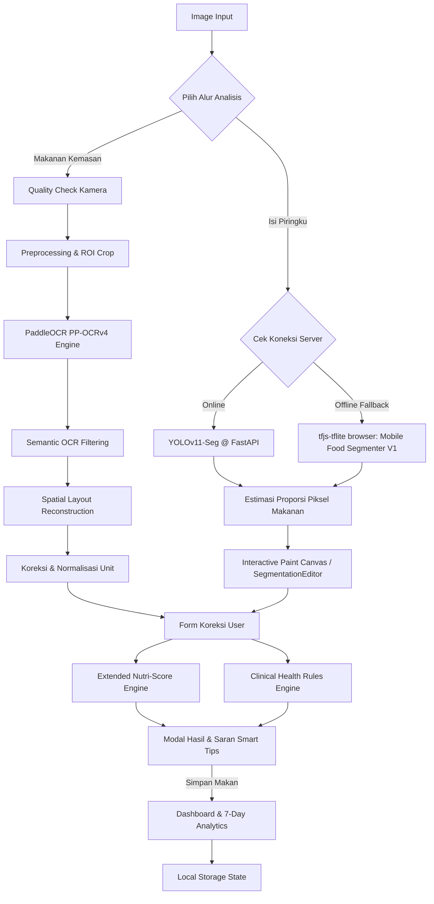

# healthier (NutriLabel v3.5) 🥗

[](https://www.python.org/)
[](https://developer.mozilla.org/en-US/docs/Web/JavaScript)
[](https://fastapi.tiangolo.com/)
[](https://github.com/PaddlePaddle/PaddleOCR)

**healthier (NutriLabel v3.5)** adalah sistem pemantauan gizi harian personal yang komprehensif berbasis Kecerdasan Buatan (AI) untuk mendeteksi kandungan nutrisi kemasan makanan dan mengestimasi porsi makan secara *real-world*. 

Sistem ini mengintegrasikan pemrosesan citra tingkat lanjut (*Computer Vision*), sistem aturan klinis terpersonalisasi (*Clinical Health Rules Engine*), dan perhitungan kualitas nutrisi tingkat lanjut (*Extended Nutri-Score*) untuk membantu pengguna memantau kesehatan harian mereka sesuai dengan standar medis nasional dan internasional.

---

## 📸 Demo Tampilan Sistem

*(Silakan tambahkan tangkapan layar atau GIF antarmuka aplikasi Anda di sini untuk meningkatkan daya tarik visual)*
> **Catatan UX**: Antarmuka dirancang dengan tema **Sleek Dark Mode** menggunakan efek *glassmorphism*, indikator progres visual SVG, grafik analitik asupan 7 hari berbasis Chart.js, serta feedback real-time saat pengambilan foto.

---

## 🛠️ Analisis Sistem: Kelebihan & Kekurangan

Secara arsitektur dan fungsionalitas, berikut adalah analisis mendalam mengenai kekuatan dan batasan dari sistem **healthier**:

### 🌟 Kelebihan (Strengths)

| Kategori | Kelebihan Teknis & Fungsional | Deskripsi & Implementasi Klinis |
| :--- | :--- | :--- |
| **Keandalan Offline** | **Dual-Mode Inference & Fallback** | Jika server lokal FastAPI mati, browser secara otomatis berpindah ke **Offline Fallback Mode** menggunakan model `@tensorflow/tfjs-tflite` (WASM) untuk segmentasi piring makan. |
| **Koreksi Presisi** | **Segmentation Editor & Canvas** | Pengguna dapat mengoreksi hasil segmentasi otomatis AI secara langsung lewat kuas warna (*brush paint*) bertransparansi 60% dan tools navigasi (Zoom, Pan, Minimap, Undo/Redo). |
| **Logika Medis** | **Clinical Rules Engine Terpersonalisasi** | Menerapkan parameter batas harian berdasarkan profil fisik & riwayat penyakit pengguna sesuai **PERKENI 2024** (untuk Diabetes) dan **JNC 8** (untuk Hipertensi). |
| **Skor Gizi Kaya** | **Extended Nutri-Score (FSA/Ofcom)** | Perluasan skor gizi tradisional dengan bonus mikronutrien (Vit C, Kalsium, Zat Besi, dll.), penyesuaian porsi riil (*Serving Fraction*), dan *Powder Reconstitution Mode*. |
| **Robust OCR** | **Production-Grade Preprocessing** | Mampu menangani kemasan di dunia nyata berkat filter pra-pemrosesan lengkap seperti *Deskew* (Hough), *Deglare* (Inpainting), *Watermark Removal*, dan *CLAHE*. |
| **Evaluasi Valid** | **Nutrient-Centric Batch Evaluator** | Mengabaikan metrik CER/WER tradisional yang kurang relevan secara klinis dan memprioritaskan *Field-Level Accuracy* untuk menjaga validitas angka gizi yang diekstrak. |

---

### ⚠️ Kekurangan & Batasan (Limitations)

| Kategori | Batasan Sistem Saat Ini | Rencana Mitigasi & Pengembangan Mendatang |
| :--- | :--- | :--- |
| **Beban Klien** | **WASM Model Loading Overhead** | Memuat pustaka TFJS-TFLite dan model `best_float16.tflite` secara lokal di browser membutuhkan memori RAM cukup tinggi pada perangkat seluler berspesifikasi rendah. |
| **Dependensi Server** | **PaddleOCR Python Dependency** | Backend OCR membutuhkan instalasi modul Python yang cukup besar (seperti `paddlepaddle` dan `paddleocr`), membutuhkan waktu setup awal yang relatif lama di lokal. |
| **Estimasi 2D** | **Perspektif 2D untuk Porsi** | Estimasi piring makan didasarkan pada perbandingan jumlah piksel segmentasi secara 2D, sehingga belum dapat mengukur ketebalan (volume 3D) makanan secara presisi. |
| **Variasi Bahasa** | **Sensitivitas Struktur Kamus** | Rekonstruksi tabel spasial gizi masih sangat bergantung pada `KAMUS_NUTRISI` (Bahasa Indonesia & Inggris). Variasi bahasa lain dapat menurunkan akurasi deteksi kolom. |

---

## 📐 Arsitektur Alur Kerja Sistem



---

## 🚀 Cara Menjalankan Aplikasi

### 1. Prasyarat Sistem
* Python 3.9 atau lebih tinggi
* Node.js (opsional, untuk Live Server) atau Extensi VS Code Live Server
* Git

### 2. Konfigurasi Backend (FastAPI + PaddleOCR + YOLOv11)
Buka terminal Anda di folder utama proyek dan jalankan perintah berikut:

```powershell
# 1. Masuk ke lingkungan virtual (contoh untuk Windows)
.\nutrilabel_env\Scripts\activate

# 2. Jalankan Server API backend
python nutrilabel_v3_ppocr.py --serve --host 127.0.0.1 --port 8000
```
> **Catatan**: Tunggu hingga muncul log `Uvicorn running on http://127.0.0.1:8000`. Request analisis pertama mungkin memerlukan waktu 15-30 detik untuk memuat model ke memori.

### 3. Konfigurasi Frontend (Web Dashboard)
1. Buka file `app.js` dan pastikan konfigurasi API mengarah ke alamat backend lokal Anda:
   ```javascript
   const API_BASE_URL = "http://127.0.0.1:8000";
   ```
2. Jalankan server lokal untuk frontend (misalnya menggunakan Live Server pada VS Code, atau via python):
   ```bash
   python -m http.server 5500
   ```
3. Akses aplikasi melalui browser di alamat `http://127.0.0.1:5500`.

---

## 🧪 Evaluasi Model & Justifikasi Riset

Akurasi ekstraksi tabel nutrisi diuji secara batch menggunakan script `evaluasi_batch.py`. 

> [!IMPORTANT]
> **Mengapa Kami Tidak Menggunakan CER/WER Sebagai Metrik Utama?**
> Di dunia nyata, foto kemasan makanan mengandung banyak teks non-gizi (slogan promosi, tanggal kadaluwarsa, dll.) yang sengaja kami saring keluar menggunakan *Semantic Filter*. Membandingkan teks terfilter dengan transkrip asli akan merusak nilai CER/WER secara semu. Oleh karena itu, riset ini berfokus pada **Field-Level Accuracy** (seberapa akurat sistem mengekstrak angka kritis seperti gula, lemak, dan natrium) yang memiliki signifikansi klinis sesungguhnya.

Untuk menjalankan pengujian evaluasi batch:
```powershell
# Menguji hanya pada gambar yang memiliki data Ground Truth (*_gt.json)
python evaluasi_batch.py -f Dataset -r --gt-only
```
Hasil evaluasi komprehensif akan disimpan secara otomatis di file `evaluasi_hasil.json` dalam folder target.

---

## ⚕️ Dasaran Klinis (Clinical Health Rules)
- **Diabetes Melitus Tipe 2**: Disesuaikan dengan konsensus nasional **PERKENI 2024**.
- **Hipertensi**: Disesuaikan dengan rekomendasi global diet rendah garam **JNC 8** dan **DASH Diet**.

Sistem secara otomatis memberikan status keamanan makanan (`SAFE`, `WARNING`, `DANGER`) yang adaptif sesuai profil riwayat penyakit pengguna.

---

*Dikembangkan untuk keperluan Penelitian Riset AI dan Kesehatan Personal Terintegrasi.*
